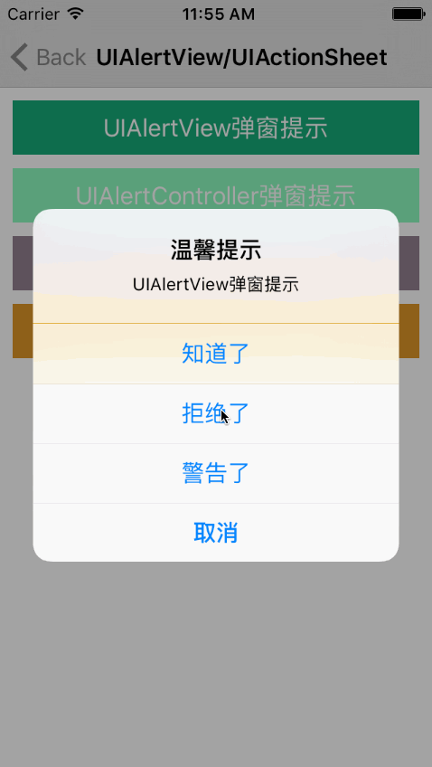

# SYCategory
UIAlertView：block响应回调
UIActionSheet：block响应回调
  
# 效果图


# 使用
#### UIAlertView
``` javascript
/// 封装Block（title标题、message信息、cancelButtonTitle/otherButtonTitles按钮、dismisse/cancel响应方法）
+ (void)alertWithTitle:(NSString *)title
               message:(NSString *)message
     cancelButtonTitle:(NSString *)cancelButtonTitle
     otherButtonTitles:(NSArray *)otherButtonTitles
            controller:(UIViewController *)controller
             onDismiss:(void (^)(int buttonIndex, NSString *buttonTitle))dismisse
              onCancel:(void (^)(void))cancel;
```

#### UIActionSheet
``` javascript
/// 封装Block（title标题、message信息对UIActionSheet无效、cancelButtonTitle/otherButtonTitles按钮、dismisse/cancel响应方法、showInView）
+ (void)actionSheetWithTitle:(NSString *)title
                     message:(NSString *)message
           cancelButtonTitle:(NSString *)cancelButtonTitle
           otherButtonTitles:(NSArray *)otherButtonTitles
                  controller:(UIViewController *)controller
                  showInView:(UIView *)view
                   onDismiss:(void (^)(int buttonIndex, NSString *buttonTitle))dismisse
                    onCancel:(void (^)(void))cancel;
```

#### UIAlertController
``` javascript
/// 封装Block（type-alert/actionSheet、title标题、message信息对UIActionSheet无效、cancelButtonTitle/otherButtonTitles按钮、dismisse/cancel响应方法、showInView针对UIActionSheet有效）
+ (void)alertWithViewType:(AlertControllerType)type
                    title:(NSString *)title
                  message:(NSString *)message
        cancelButtonTitle:(NSString *)cancelButtonTitle
        otherButtonTitles:(NSArray *)otherButtonTitles
               controller:(UIViewController *)controller
               showInView:(UIView *)view
                onDismiss:(void (^)(int buttonIndex, NSString *buttonTitle))dismisse
                 onCancel:(void (^)(void))cancel;
```