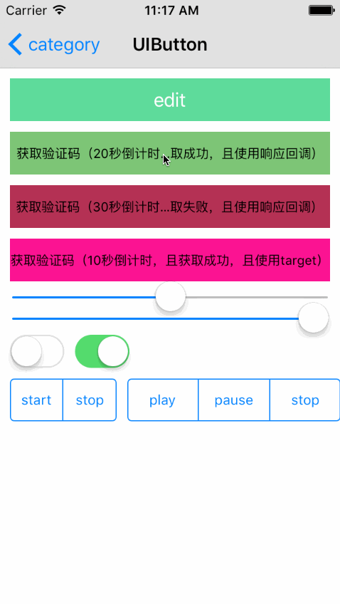

# SYCategory
UIButton：图标对齐方式、倒计时功能、block响应回调
  
# 效果图


# 使用
``` javascript
// 倒计时按钮样式
/// 设置当前按钮为倒计时类型的按钮
- (void)setButtonCountdownType;

/// 倒计时长（默认60秒）
- (void)setButtonCountdownTime:(NSTimeInterval)time;

/// 倒计时开始后显示样式（菊花转，或文字，默认菊花转）
- (void)setButtonCountedownStartType:(SYCountdownStartType)type;

/// 倒计时按钮状态（开始请求网络，请求成功-倒计时，请求失败-常规/停止。特别说明，若在倒计时进行时，务必在视图释放时在方法"- (void)viewWillDisappear:(BOOL)animated { }"中置为CountdownTypeStop）
- (void)setButtonCountdownType:(SYCountdownType)type;

/// 按钮标题-normal（默认@"获取验证码"）
@property (nonatomic, strong) NSString *titleNormal;
/// 按钮标题-disabledStart（默认@"正在获取..."）
@property (nonatomic, strong) NSString *titleDisabledStart;
/// 按钮标题-disabledFinish（默认@"N秒"）
@property (nonatomic, strong) NSString *titleDisabledFinish;

/// 字体大小
@property (nonatomic, strong) UIFont *titleFont;
/// 字体颜色-normal
@property (nonatomic, strong) UIColor *colorNormal;
/// 字体颜色-disabledStart/disabledFinish
@property (nonatomic, strong) UIColor *colorDisabled;
```

``` javascript
/// 图片与标题显示样式（offset大于0时拉开距离，offset小于0时缩小距离）
- (void)buttonStyle:(SYButtonStyle)style offSet:(CGFloat)offset;

/// 回调方法
@property (nonatomic, copy) ButtonClick buttonClick;
``` 