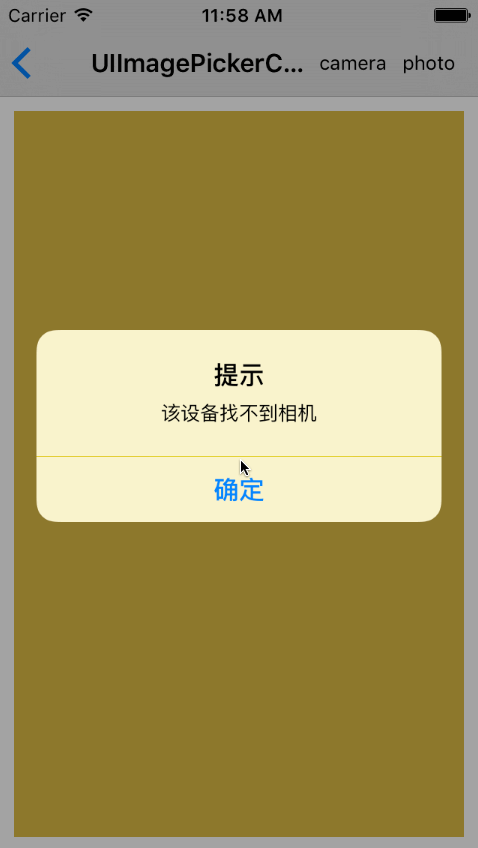

# SYCategory
UIImagePickerController：block响应回调

# 效果图


# 使用
``` javascript
// 相机拍照
__weak typeof(self) weakSelf = self
[UIImagePickerController pickerImageWithType:UIImagePickerControllerSourceTypeCamera target:self complete:^(UIImage *image) {
    if (image)
    {
        UIImageView *imageview = (UIImageView *)[weakSelf.view viewWithTag:1000];
        imageview.image = image;
    }
    else
    {
        NSLog(@"未成功获取到相片");
    }
} photosAlbum:YES saveStart:^{
    NSLog(@"正在保存图片");
} saveFinish:^(SavePhotoStatus status) {
    NSLog(@"图片保存：%@", (SavePhotoSuccess == status ? @"成功" : @"失败"));
}];
```

``` javascript
// 相册选择图片
__weak typeof(self) weakSelf = self
[UIImagePickerController pickerImageWithType:UIImagePickerControllerSourceTypePhotoLibrary target:self complete:^(UIImage *image) {
    if (image)
    {
        UIImageView *imageview = (UIImageView *)[weakSelf.view viewWithTag:1000];
        imageview.image = image;
    }
    else
    {
        NSLog(@"未成功获取到相片");
    }
} photosAlbum:YES saveStart:^{
    NSLog(@"正在保存图片");
} saveFinish:^(SavePhotoStatus status) {
    NSLog(@"图片保存：%@", (SavePhotoSuccess == status ? @"成功" : @"失败"));
}];

```