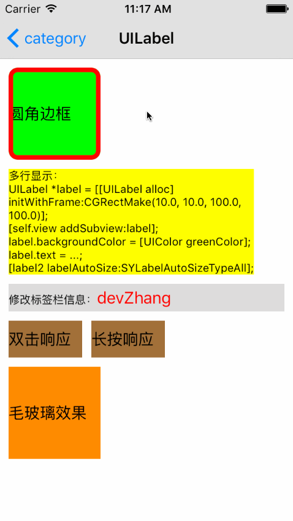

# SYCategory
UILabel：自适应宽高、修改内容（指定文字颜色，大小，间距）

# 效果图



# 使用示例
``` javascript
/**
*  修改标签信息（文字大小颜色）
*
*  @param string         要修改的文字
*  @param textColor      要修改的文字颜色
*  @param textFont       要修改的文字大小
*/
- (void)labelAttributedText:(NSString *)string color:(UIColor *)textColor font:(UIFont *)textFont;

/**
*  修改标签信息（字符间距，行间距，文字大小颜色）
*
*  @param string         要修改的文字
*  @param textColor      要修改的文字颜色
*  @param textFont       要修改的文字大小
*  @param characterSpace 字体间距
*  @param rowSpace       行间距
*/
- (void)labelAttributedText:(NSString *)string color:(UIColor *)textColor font:(UIFont *)textFont space:(CGFloat)characterSpace rowSpace:(CGFloat)rowSpace;
```

``` javascript
/// 设置自适应标签宽高
- (void)labelAutoSize:(SYLabelAutoSizeType)type;
``` 
 