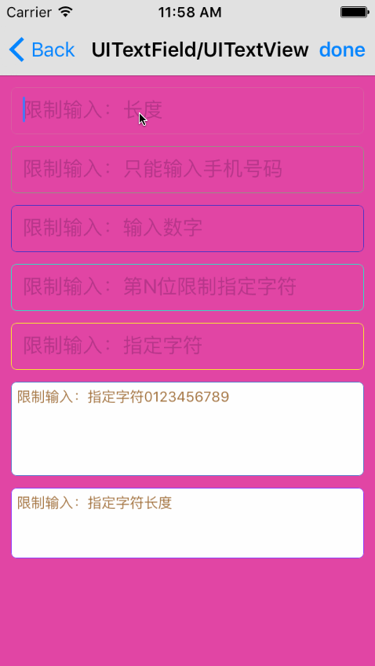

# SYCategory
UITextField：输入限制
UITextView：输入限制

# 效果图


# 使用
#### UITextField
``` javascript
/// 字符输入字数限制（不需要结合通知使用）
@property (nonatomic, assign) NSInteger limitMaxLength;

/// 限制不能输入指定字符（不需要结合通知使用）
@property (nonatomic, strong) NSString *limitText;
/// 限制只能输入指定字符（不需要结合通知使用）
@property (nonatomic, strong) NSString *allowedText;
``` 

``` javascript
/// 限制UITextField输入的长度（不区分中英文字符，通知方法名UITextFieldTextDidChangeNotification）
- (void)limitTextFieldLength:(NSUInteger)maxLength;

/// 限制UITextField输入的长度（区分中英文字符，通知方法名UITextFieldTextDidChangeNotification）
- (void)limitTextFieldCNLength:(NSUInteger)maxLength;
``` 

``` javascript
/**
*  手机号输入限制（异常：中文联想字能被输入）
*
*  回调方法“- (BOOL)textField:(UITextField *)textField shouldChangeCharactersInRange:(NSRange)range replacementString:(NSString *)string”中使用
*
*  @param range  当前输入区间
*  @param string 当前输入字符
*
*  @return BOOL
*/
- (BOOL)limitMoblieShouldChangeCharactersInRange:(NSRange)range replacementString:(NSString *)string;

/**
*  数字输入限制（异常：中文联想字能被输入）
*
*  回调方法“- (BOOL)textField:(UITextField *)textField shouldChangeCharactersInRange:(NSRange)range replacementString:(NSString *)string”中使用
*
*  @param range         当前输入区间
*  @param string        当前输入字符
*  @param integerLength 整数位数，0时无限制
*  @param greater       整数首位是否大于0
*  @param decimal       是否带小数
*  @param decimalLength 小数位数
*
*  @return BOOL
*/
- (BOOL)limitNumberShouldChangeCharactersInRange:(NSRange)range replacementString:(NSString *)string integer:(NSInteger)integerLength greaterThanZero:(BOOL)greater decimalPoint:(BOOL)decimal decimalDigits:(NSInteger)decimalLength;

/**
*  第N位限制不能输入指定字符（异常：中文联想字能被输入）
*
*  回调方法“- (BOOL)textField:(UITextField *)textField shouldChangeCharactersInRange:(NSRange)range replacementString:(NSString *)string”中使用
*
*  @param range  当前输入区间
*  @param string 当前输入字符
*  @param limits 限制不能输入的字符
*  @param index  限制的第N位
*
*  @return BOOL
*/
- (BOOL)limitCharacterShouldChangeCharactersInRange:(NSRange)range replacementString:(NSString *)string limitCharacters:(NSString *)limits limitIndex:(NSInteger)index;

/**
*  限制输入长度（异常：中文联想字能被输入）
*
*  回调方法“- (BOOL)textField:(UITextField *)textField shouldChangeCharactersInRange:(NSRange)range replacementString:(NSString *)string”中使用
*
*  @param maxLength 限制最大输入长度
*  @param range     当前输入区间
*  @param string    当前输入字符
*
*  @return BOOL
*/
- (BOOL)limitLength:(int)maxLength shouldChangeCharactersInRange:(NSRange)range replacementString:(NSString *)string;

/**
*  限制输入的字符（异常：中文联想字能被输入）
*
*  回调方法“- (BOOL)textField:(UITextField *)textField shouldChangeCharactersInRange:(NSRange)range replacementString:(NSString *)string”中使用
*
*  @param string   当前正在输入的字符
*  @param limitStr 限制输入指定的字符串
*  @param canEdit  YES只能输入指定字符，NO只能输入指定字符外的其他字符
*
*  @return BOOL
*/
- (BOOL)limitTextField:(NSString *)string limitStr:(NSString *)limitStr edit:(BOOL)canEdit;
```

#### UITextView
``` javascript
/// 限制UITextView输入的长度（不区分中英文字符）
- (void)limitTextViewLength:(NSUInteger)maxLength;

/// 限制UITextView输入的长度（区分中英文字符）
- (void)limitTextViewCNLength:(NSUInteger)maxLength;
```

``` javascript
/// 占位符提示语（默认无。如有字符输入限制则先设置限制字符）
@property (nonatomic, strong) NSString *placeHolderText;

/// 占位符提示语字体大小（默认与textview的系统字体大小一致）
@property (nonatomic, strong) UIFont *placeHolderTextFont;

/// 占位符提示语字体颜色（默认灰色）
@property (nonatomic, strong) UIColor *placeHolderTextColor;
```

``` javascript
/// 字符输入字数限制
@property (nonatomic, assign) NSInteger limitMaxLength;

/// 限制不能输入指定字符（不需要结合通知使用）
@property (nonatomic, strong) NSString *limitText;

/// 限制只能输入指定字符（不需要结合通知使用）
@property (nonatomic, strong) NSString *allowedText;
```
