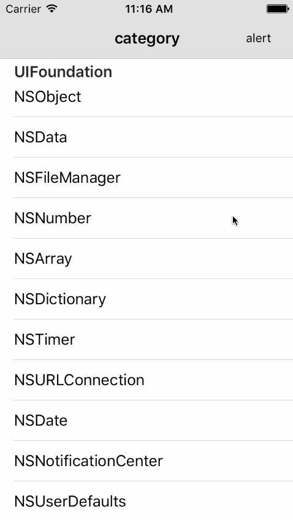

# SYCategory
自定义UIKit、Foundation的类别，以适应在研发过程中常使用到的功能，提高开发效率。

# UIKit类别
  * [UILabel：自适应宽高、修改内容（指定文字颜色，大小，间距）](https://github.com/potato512/SYCategory/tree/master/CategoryRead/UILabelCategory)
  * [UIView：原点坐标设置、显示标签（内容，字体大小/颜色，对齐方式）、手势功能、缩放、旋转、翻转](https://github.com/potato512/SYCategory/tree/master/CategoryRead/UIViewCategory)
  * [UIButton：图标对齐方式、倒计时功能、block响应回调](https://github.com/potato512/SYCategory/tree/master/CategoryRead/UIButtonCategory)
  * [UISlider：block响应回调](https://github.com/potato512/SYCategory/tree/master/CategoryRead/UISliderCategory)
  * [UISwitch：block响应回调](https://github.com/potato512/SYCategory/tree/master/CategoryRead/UISwitchCategory)
  * [UISegmentedControl：响应回调](https://github.com/potato512/SYCategory/tree/master/CategoryRead/UISegmentedControlCategory)
  * [UIBarButtonItem：响应回调](https://github.com/potato512/SYCategory/tree/master/CategoryRead/UIBarButtonItemCategory)
  * [UIColor：十六进制颜色、随机颜色](https://github.com/potato512/SYCategory/tree/master/CategoryRead/UIColorCategory)
  * [UIImage：纯色图片、图片拉升、截图、压缩、裁剪、位图处理、滤镜、相册图片、保存](https://github.com/potato512/SYCategory/tree/master/CategoryRead/UIImageCategory)
  * [UIGestureRecognizer：block响应回调](https://github.com/potato512/SYCategory/tree/master/CategoryRead/UIGestureRecognierCategory)
  * [UIViewController：根视图判断、导航栏标题、导航栏视图、导航栏返回按钮、导航栏右按钮](https://github.com/potato512/SYCategory/tree/master/CategoryRead/UIViewControllerCategory)
  * [UINavigationController：导航栏样式](https://github.com/potato512/SYCategory/tree/master/CategoryRead/UINavigationControllerCategory)
  * [UITabBarController：页签样式](https://github.com/potato512/SYCategory/tree/master/CategoryRead/UITabBarControllerCategory)
  * [UIAlertView：block响应回调](https://github.com/potato512/SYCategory/tree/master/CategoryRead/UIAlertViewCategory)
  * [UIActionSheet：block响应回调](https://github.com/potato512/SYCategory/tree/master/CategoryRead/UIAlertViewCategory)
  * [UITextField：输入限制](https://github.com/potato512/SYCategory/tree/master/CategoryRead/UITextFiledCategory)
  * [UITextView：输入限制](https://github.com/potato512/SYCategory/tree/master/CategoryRead/UITextFiledCategory)
  * [UIImagePickerController：block响应回调](https://github.com/potato512/SYCategory/tree/master/CategoryRead/UIImagePickerViewControllerCategory)

# Foundation类别
 * [NSString：其他对象的互换、数字/金额等的处理、特殊字符的限制](https://github.com/potato512/SYCategory/tree/master/CategoryRead/NSStringCategory)
 * [NSFileManager：文件操作、目录操作](https://github.com/potato512/SYCategory/tree/master/CategoryRead/NSFileManagerCategory)
 * [NSAttributedString：副文本字符串处理](https://github.com/potato512/SYCategory/tree/master/CategoryRead/NSAttributedStringCategory)
 * [NSNumber：](https://github.com/potato512/SYCategory/tree/master/CategoryRead/NSNumberCategory)
 * [NSObject：图片类型判断、文本字符宽高计算、结束编辑处理](https://github.com/potato512/SYCategory/tree/master/CategoryRead/NSObjectCategory)
 * [NSArray：异常判断、排序、元素操作](https://github.com/potato512/SYCategory/tree/master/CategoryRead/NSArrayCategory)
 * [NSDictionary：异常判断](https://github.com/potato512/SYCategory/tree/master/CategoryRead/NSDictionaryCategory)
 * [NSTimer：](https://github.com/potato512/SYCategory/tree/master/CategoryRead/NSTimerCategory)
 * [NSURLConnection：请求block回调处理](https://github.com/potato512/SYCategory/tree/master/CategoryRead/NSURLConnectionCategory)
 * [NSDate：日期处理](https://github.com/potato512/SYCategory/tree/master/CategoryRead/NSDateCategory)
 * [NSNotificationCenter：](https://github.com/potato512/SYCategory/tree/master/CategoryRead/NSNotificationCenterCategory)
 * [NSUserDefaults：](https://github.com/potato512/SYCategory/tree/master/CategoryRead/NSUserDefaultsCategory)

# 效果图

# 修改说明
* 添加类别文件：NSFileHandle+SYCategory
* 完善类别方法：NSFileManager+SYCategory

## 20170628
* UIImage方法修改
~~~ javascript
// 废除：获取图片，根据图片url（如：url = http://.../xxx.jpg）
+ (UIImage *)imageWithUrl:(NSString *)url;

/// 新增：获取图片，根据图片url-缓存功能（如：url = http://.../xxx.jpg）
+ (void)imageWithUrl:(NSString *)url complete:(void ((^)(UIImage *image)))complete;
~~~

## 20170627 
* UIImage添加纯色生成图片方法
~~~ javascript
/// 生成指定颜色的图片
+ (UIImage *)imageWithColor:(UIColor *)color;
~~~

