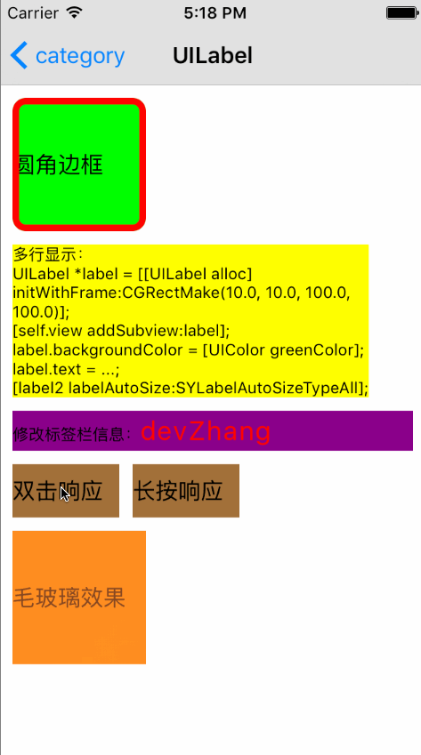
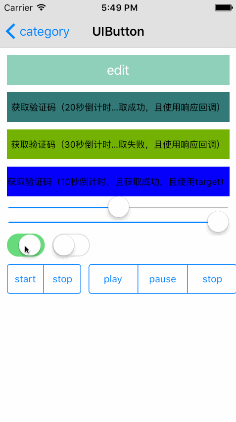
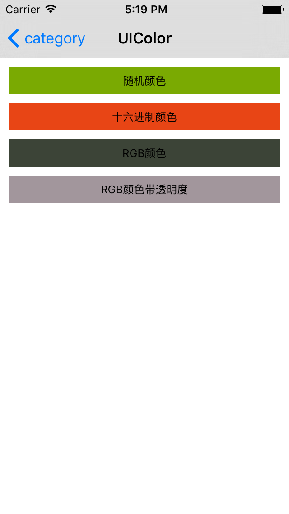
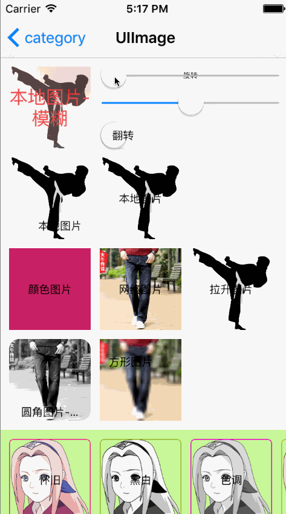
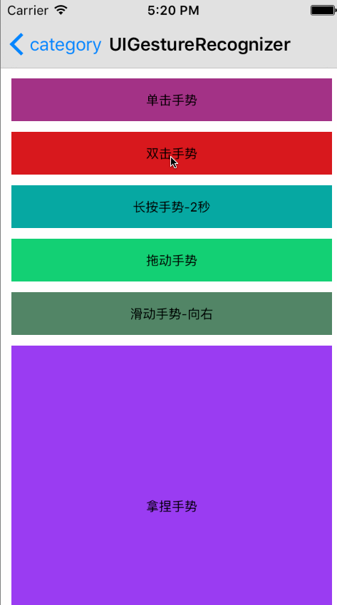
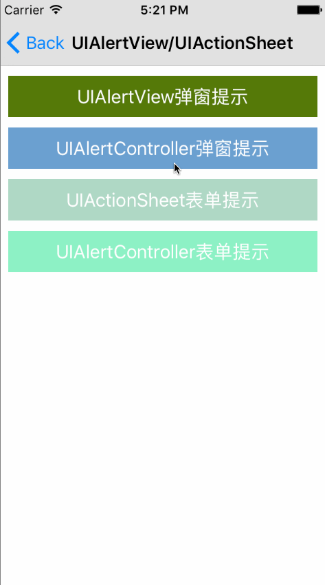
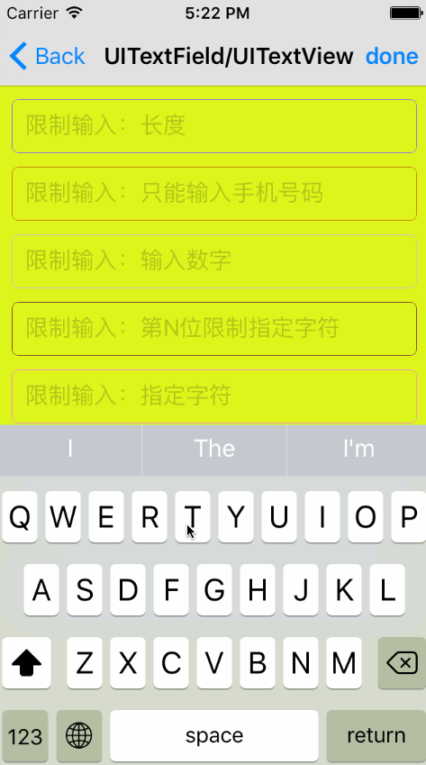
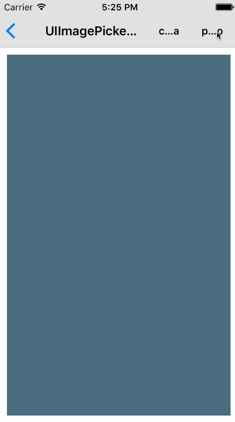

# UIKit类别
  * UILabel：自适应宽高、修改内容（指定文字颜色，大小，间距）
  * UIView：原点坐标设置、显示标签（内容，字体大小/颜色，对齐方式）、手势功能、缩放、旋转、翻转
  * UIButton：图标对齐方式、倒计时功能、block响应回调
  * UISlider：block响应回调
  * UISwitch：block响应回调
  * UISegmentedControl：block响应回调
  * UIColor：十六进制颜色、随机颜色
  * UIImage：纯色图片、图片拉升、截图、压缩、裁剪、位图处理、滤镜、相册图片、保存
  * UIGestureRecognizer：block响应回调
  * UIViewController：根视图判断、导航栏标题、导航栏视图、导航栏返回按钮、导航栏右按钮
  * UINavigationController：导航栏样式
  * UIAlertView：block响应回调
  * UIActionSheet：block响应回调
  * UIAlertController：block响应回调
  * UITextField：输入限制
  * UITextView：输入限制
  * UIImagePickerController：block响应回调

# 效果图

